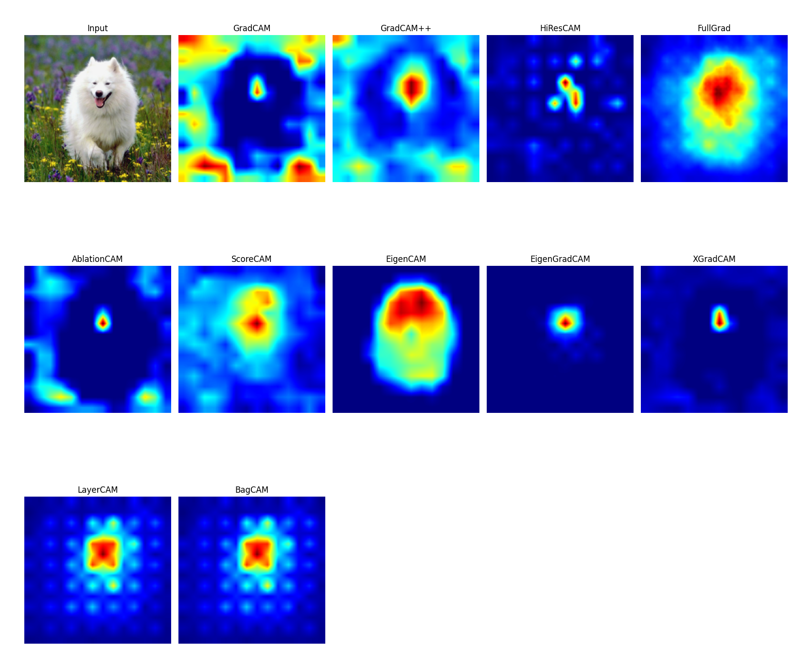
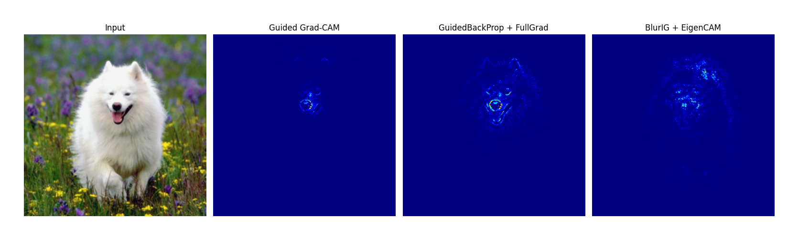

# Attritbuion Methods for Image Classification Models
This is an ongoing work to implement various attribution methods for image classification models in PyTorch using a unified framework. 

We only consider plug-and-play methods that **do not have special requirements on the model architecture and do not need to add modules with learnable parameters or additional training**. At the same time, we hope to facilitate weakly-supervised localization and segmentation using attribution results, as well as incorporating them as part of model training (e.g., use the attribution results as additional supervision information). Therefore, all methods use PyTorch tensors for calculations as much as possible, support batch input, and GPU usage.

## Gradients Visualization
some results of resnet50 from timm, example code at [./gradientss_visualization_examples.py](./gradients_visualization_examples.py)

## Class Activation Map (CAM) Visualization
resnet50, the target layer is `layer3`, example code at [./cam_visualization_examples.py](./cam_visualization_examples.py)

## Combine Gradients and CAM Visualization
similar to Guided Grad-CAM, any method in the gradient visualization can be combined with CAM visualization, example code at [./combine_cam_and_gradients_visualization_examples.py](./combine_cam_and_gradients_visualization_examples.py)

## TODO:
- [x] Unify gradient visualization API.
- [x] Implement CAM visualization for CNN models based on known target_layer names.
- [ ] Implement CAM for ViT ,Swin Transformer and etc.
- [ ] Implement some new methods (after 2023) and some methods without official implementation.
- [ ] Documentation for gradient visualization.
- [ ] Documentation for CAM visualization.
- [ ] Unify all APIs.

## Acknowledgements
This project is inspired by [timm](https://github.com/huggingface/pytorch-image-models), [jacobgil/pytorch-grad-cam](https://github.com/jacobgil/pytorch-grad-cam), [PAIR-code/saliency](https://github.com/PAIR-code/saliency) and [hummat/saliency](https://github.com/hummat/saliency). Thanks for their wonderful work.

