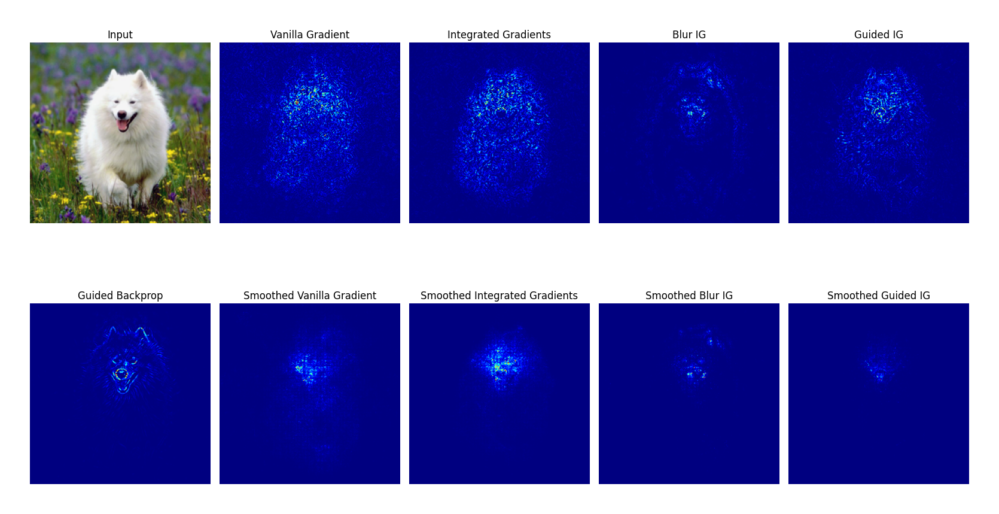

# Attritbuion Methods for Image Classification Models
This is an ongoing work to implement various attribution methods for image classification models in PyTorch using a unified framework. 

We only consider plug-and-play methods that **do not have special requirements on the model architecture and do not need to add modules with learnable parameters or additional training**. At the same time, we hope to facilitate weakly-supervised localization and segmentation using attribution results, as well as incorporating them as part of model training (e.g., use the attribution results as additional supervision information). Therefore, all methods use PyTorch tensors for calculations as much as possible, support batch input, and GPU usage.

## Gradients Visualization
**CNN models**: some results of resnet50 from timm, example code at [./gradientss_visualization_examples.py](./gradients_visualization_examples.py).




**Vision/Swin Transformers**: gradients visualization methods can be directly used for transformers, example code at [./gradients_visualization_for_transformers_examples.py](./gradients_visualization_for_transformers_examples.py).


## Class Activation Map (CAM) Visualization
resnet50, the target layer is `layer3`, example code at [./cam_visualization_examples.py](./cam_visualization_examples.py)


## Combine Gradients and CAM Visualization
similar to Guided Grad-CAM, any method in the gradient visualization can be combined with CAM visualization, example code at [./combine_cam_and_gradients_visualization_examples.py](./combine_cam_and_gradients_visualization_examples.py)


## Quick Start
```python
from matplotlib import pyplot as plt
from PIL import Image
import requests
import timm
from timm.data import resolve_model_data_config
from timm.data.transforms_factory import create_transform
import torch

from attribution import BlurIG, GradCAM, CombinedWrapper
from attribution.utils import normalize_saliency, visualize_single_saliency

# Load imagenet labels
IMAGENET_1k_URL = 'https://storage.googleapis.com/bit_models/ilsvrc2012_wordnet_lemmas.txt'
IMAGENET_1k_LABELS = requests.get(IMAGENET_1k_URL).text.strip().split('\n')

# Load model
device = torch.device("cuda" if torch.cuda.is_available() else "cpu")
model = timm.create_model('resnet50', pretrained=True)
model = model.to(device)
model.eval()
config = resolve_model_data_config(model, None)
transform = create_transform(**config)

# Load image
dog = Image.open('examples/dog.png').convert('RGB')
dog_tensor = transform(dog).unsqueeze(0)
H, W = dog_tensor.shape[-2:]
img = transform(dog).unsqueeze(0)

# We support batch input
img = torch.cat([img, img])
img = img.to(device)
output = model(img)
target_index = torch.argmax(output, dim=1).cpu()
print('Predicted:', IMAGENET_1k_LABELS[target_index[0].item()])

# Gradients visualization
blur_ig_kwargs = {'steps': 100, 
                  'batch_size': 4, 
                  'max_sigma': 50, 
                  'grad_step': 0.01, 
                  'sqrt': False}
blur_ig_net = BlurIG(model)
blur_ig = normalize_saliency(blur_ig_net.get_mask(img, target_index, **blur_ig_kwargs))

# CAM visualization
gradcam_net = GradCAM(model)
gradcam = normalize_saliency(
    gradcam_net.get_mask(img, target_index, target_layer='layer3'))

# Combine Gradients and CAM visualization
combined = CombinedWrapper(model, BlurIG, GradCAM)
combined_saliency = normalize_saliency(
    combined.get_mask(img, target_index, target_layer='layer3', **blur_ig_kwargs))

# Visualize
plt.figure(figsize=(16, 5))
plt.subplot(1, 4, 1)
plt.imshow(dog)
plt.title('Input Image')
plt.axis('off')
plt.subplot(1, 4, 2)
visualize_single_saliency(blur_ig[0].unsqueeze(0))
plt.title('Blur IG')
plt.subplot(1, 4, 3)
visualize_single_saliency(gradcam[0].unsqueeze(0))
plt.title('GradCAM')
plt.subplot(1, 4, 4)
visualize_single_saliency(combined_saliency[0].unsqueeze(0))
plt.title('Combined')
plt.tight_layout()
plt.savefig('examples/quick_start.png', bbox_inches='tight', pad_inches=0.5)
```


## CAM Visualization for ViT and Swin Transformer
use `attribution.utils.get_reshape_transform` when creating the attribution model, example code at [./cam_visualization_for_transformers_examples.py](./cam_visualization_for_transformers_examples.py). 


Currently, some methods are not supported for transformers, such as Ablation-CAM, and the visualization effect is not as good as CNN models since many methods are designed with the concept of feature maps. We will try to add visualization methods that are designed for transformers in the future.

## TODO:
- [x] Unify gradient visualization API.
- [x] Implement CAM visualization for CNN models based on known target_layer names.
- [x] Implement CAM for ViT ,Swin Transformer and etc.
- [ ] Implement some new methods (after 2023) and some methods without official implementation.
- [ ] Unify all APIs.
- [ ] Documentation.


## Acknowledgements
This project is inspired by [jacobgil/pytorch-grad-cam](https://github.com/jacobgil/pytorch-grad-cam), [PAIR-code/saliency](https://github.com/PAIR-code/saliency) and [hummat/saliency](https://github.com/hummat/saliency). Thanks for their wonderful work.

